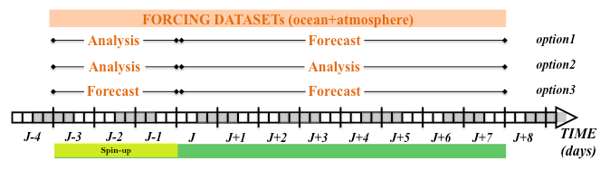
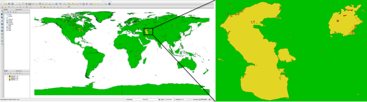

.. _io_datasets:

***************************
Input/Output Model Datasets
***************************

In order to execute the SURF-NEMO package, the user has to provide a number of input datasets. These
include the bathymetry datasets containing the sea floor elevation, the coastline datasets delineating borders
between land and sea areas, the initial condition dataset containing initial values of model-predicted variables
and the boundary condition datasets at the surface and lateral open boundaries of the domain containing
... These datasets will be use to impose initial and boundary conditions on flows of mass, momentum and
energy for the primitive equation. In Figure ?? are summarized the interfaces and the external forcings
acting on a typical computational domain.

Almost all initial/output model datasets are in the classic NetCDF format. NetCDF is a widely used file format
in atmospheric and oceanic research, which allows storage of different types of array based data,
along with a short data description.

.. container:: twocol

   .. container:: leftside

      The classic netCDF data model consists of dimensions, variables
      and attributes, each identified both by a name
      and an ID number. A dimension may be used to represent
      a real physical dimension, for example, time,
      latitude, longitude, or depth. A NetCDF dimension
      has both a name and a length, where the dimension
      length is an arbitrary positive integer. Variables are
      used to store the bulk of the data in a NetCDF
      dataset. A variable is an N-dimensional array of
      data, with a name, a data type, and a shape described
      by its list of dimensions. Each dimensions
      have corresponding variables, called coordinate variable, that hold the values along that axis.
      Figure xx show an example of CDL text rappresentation of this file.

   .. container:: rightside

      .. figure:: _static/figure/fig_datasets/netcdf.png
         :name: fig-netcdf
         :width: 500px

         Exemple of a CDL rappresentation of a NetCDF file.

.. |clearfloat|  raw:: html

   

|clearfloat|

The input coastline datasets are instead in Shapefile format.
The shapefile format is a digital vector data format for geographic information system (GIS) software.
This format allows the storage of geometric location and associated attribute information.

.. container:: twocol

   .. container:: leftside

      Geographic features in a shapefile can be represented by points, lines, or polygons (areas).
      for example, water wells, rivers, and lakes.
      The shapefile format consists of a collection of files with a common filename prefix, stored in the same directory. The
      three mandatory files have filename extensions .shp, .shx, and .dbf.

   .. container:: rightside

      .. figure:: _static/figure/fig_datasets/Simple_vector_map.png
         :name: fig-shapefile
         :width: 500px

         Exemple of a shapefile.

|clearfloat|

In this chapter we describe the input datasets required and the output datasets produced by the model

Source Input Datasets
=====================

SURF split the simulation period in pre- and post- spinup period.
The spinup time is ... but here we use ...
Different options are possible (fig. :numref:`fig-pre_post_spinup`) according the input
atmospheric and ocean datasets the child model ingest during the execution in order
to impose the surface and lateral boundary conditions.
SURF platform can be used for different objectives.

1. Produce a forecast model for the next 7 days [J:J+7]: the model use as input analysis + forecast data,
2. Produce a forecast model for the next 7 days [J:J+7]: the model use as input forecast + forecast data,
3. Produce a hindcast model (historical re-forecast) for the n days: the model use as input analysis + analysis data,

   Possible type of model execution according the input data used.

Bathymetry Dataset
------------------
The source bathymetry dataset is required in the child meshmask generation phase.
The user needs to specified the values of path/file name and dimensions/variables
name of the data in the configuration file ``setParFree.json`` (section ``set_dataDownlBat``).

.. container:: twocol

   .. container:: leftside

      This dataset contains the sea floor elevation (in meters) at a certain horizontal resolution.
      The elevation are relative to specific reference level and can be
      increases (positive) or decreases (negative) with increasing water depth.
      The data are distributed on a regular grid within a region containing the nested domain.
      The coordiante variable can be a one- or two-dimensional array.
      An example of CDL text representation of this file is shown in :numref:`cdl_bathymetry`.

   .. container:: rightside

      .. code-block:: html
         :name: cdl_bathymetry
         :caption: CDL example for the bathymetry data

         netcdf bathymetry_filename {
         dimensions:
            x = 300;
            y = 200;
         variables: \\
            float lon(y,x);
                  lon: units = "degrees_east";
            float lat(y,x);
                  lat: units = "degrees_north";
            float elevation(y,x);
                  elevation: units = "m";
         }

|clearfloat|

The user can specify in the user-configuration file (section ``set_dataDownlBat_fileName``):

* if the file to download is compressed (.gzip) or not,
* if longitude coordinate is in the the rage [0:360] or [-180:+180],
* if longitude coordinate is cyclic coordinates???
* if the dataset contains latitude decreasing through the pole,
* if the original downloaded file need to be deleted after cutted in the nested domain.

Coastline Dataset
-----------------

The source coastline dataset is required in the child meshmask generation phase.
The user needs to specified the values of path/file name in the configuration file ``setParFree.json`` (section ``set_dataDownlCoast``).

The coastline dataset contains borders between land and sea areas and are stored into shapefiles.
We use the Global Self-consistent Hierarchical High-resolution Geography (GSHHG) dataset produced by
the National Oceanic and Atmospheric Association (NOAA). The datasets includes 20 shapefiles which
provides a consistent set of hierarchically arranged closed polygons from which the shorelines are constructed.
The GSHHS data are split into separate shapefiles at five different resolutions:

* the highest resolution is designated ’f’ (full)
* the next highest appears as ’h’ (high)
* and then (intermediate) ’i’, (low) ’l’, (coarse) ’c’.

For each level of resolution there are four types of content: land, lakes, islands in lakes, and ponds on islands in
lakes.

.. _fig-coastline:

   Exemple of a coastline shapefile.

Initial Condition Datasets
--------------------------

In order to start a model run, the initial values for the model prognostic variables need to be specified.
These include temperature, salinity, sea surface height, and velocity fields.
Initial condition datasets are normally provided by a coarse grid model outputs.
The user needs to specified the values of path/file name and dimensions/variables
name of the data in the configuration file ``setParFree.json`` (section ``set_dataDownlOceIC``).
The model assume that all the input ocean variables are defined on the same grid.

.. container:: twocol

   .. container:: leftside

      The coarse resolution ocean files contain the following
      variables at a certain horizontal resolution.

      * Potential Temperature [C],
      * Salinity [PSU],
      * Sea surface height [m],
      * Zonal velocity [ms^-1],
      * Meridional Velocity [ms^-1].

      The data are distributed on the Arakawa grid (regular or curv grid)
      within a region containing the nested domain.
      An example of CDL text representation of this file is shown in :numref:`cdl_oceIC`.

   .. container:: rightside

      .. code-block:: html
         :name: cdl_oceIC
         :caption: CDL example for the Initial Condition data

         netcdf fields_filename {
         dimensions :
            x = 677;
            y = 253;
            z = 72;
            t = UNLIMITED ; // (7 currently)
         variables : \\
            float lont(x);
                  lont: units = "degrees_east";
            float latt(y);
                  latt: units = "degrees_north";
            float deptht(z);
                  deptht: units = "m";
            double time(t) ;
                   time: units = "seconds since 1970 -01 -01 00:00:00";
            float temperature(t,z,y,x);
                  temperature: units = "degC";
         }

|clearfloat|

In order to perform ..., the meshmask file need to be provided as input datasets.
The user needs to specified the values of path/file name and dimensions/variables
name of the meshmask data in the configuration file ``setParFree.json`` (section ``set_dataDownlOceICMesh``).

.. container:: twocol

   .. container:: leftside

      This file contains all the information of the coarse resolution ocean model grids
      and it includes the following variables:

      * longitude on TUV grid points [degree],
      * latitude on TUV grid points [degree],
      * depth on TUV grid points [m],
      * land/sea mask on TUV grid points [x],
      * scalefactor on TUV grid points [x],
      * scalefactor on TUV grid points [x],
      * scalefactor on TUV grid points [x].

      An example of CDL text representation of this file is shown in :numref:`cdl_oceICmask`.

   .. container:: rightside

      .. code-block:: html
         :name: cdl_oceICmask
         :caption: CDL example for the Initial Condition meshmask data

         netcdf meshmask_filename {
         dimensions :
            x = 677;
            y = 253;
            z = 72;
            t = UNLIMITED; // (7 currently)
         variables : \\
            float lon(y,x);
            float lat(y,x);
            float lev(z);
            double time(t);
            byte tmask(t,z,y,x);
            byte umask(t,z,y,x);
            byte vmask(t,z,y,x);
            byte fmask(t,z,y,x);
            float glamt(t,y,x);
            float glamu(t,y,x);
            float glamv(t,y,x);
            float glamf(t,y,x);
            float gphit(t,y,x);
            float gphiu(t,y,x);
            float gphiv(t,y,x);
            float gphif(t,y,x);
            double e1t(t,y,x);
            double e1u(t,y,x);
            double e1v(t,y,x);
            double e1f(t,y,x);
            double e2t(t,y,x);
            double e2u(t,y,x);
            double e2v(t,y,x);
            double e2f(t,y,x);
            double e3t(t,z,y,x);
            double e3u(t,z,y,x);
            double e3v(t,z,y,x);
            double e3w(t,z,y,x);
         }

|clearfloat|

Lateral Open Boundary Condition Datasets
----------------------------------------

In order to integrate the primitive equations, the NEMO ocean model need to impose appropriate
boundary conditions at the ocean-ocean interface (i.e. the sides of the domain not bounded by land).
Lateral Open Bounday values for the model prognostic variables need to be specified for all the simulation period.
These include temperature, salinity, sea surface height, and velocity fields.
The user needs to specified the values of path/file name and dimensions/variables
name of the data in the configuration file ``setParFree.json`` (sections ``set_dataDownlOceBC_preSpinup`` and ``set_dataDownlOceBC_postSpinup``).
The model assume that all the input ocean variables in pre- and post- spinup period are defined on the same grid.

.. container:: twocol

   .. container:: leftside

      The coarse resolution ocean files contain the following variables at a certain
      horizontal resolution and temporal frequency. The data
      are distributed on the Arakawa grid (regular or curv
      grid) within a region containing the nested domain.

      * Potential Temperature [C],
      * Salinity [PSU],
      * Sea surface height [m],
      * Zonal velocity [ms^-1],
      * Meridional Velocity [ms^-1].

      An example of CDL text representation of this file is shown in :numref:`cdl_oceBC`.

   .. container:: rightside

      .. code-block:: html
         :name: cdl_oceBC
         :caption: CDL example for the Open boundary Condition data

         netcdf fields_filename {
         dimensions :
            x = 677;
            y = 253;
            z = 72;
            t = UNLIMITED ; // (7 currently)
         variables : \\
            float lont(x);
                  lont: units = "degrees_east";
            float latt(y);
                  latt: units = "degrees_north";
            float deptht(z);
                  deptht: units = "m";
            double time(t) ;
                   time: units = "seconds since 1970 -01 -01 00:00:00";
            float temperature(t,z,y,x);
                  temperature: units = "degC";
         }

|clearfloat|

In order to perform ..., the meshmask file need to be provided as input datasets.
The user needs to specified the values of path/file name and dimensions/variables
name of the meshmask data in the configuration file ``setParFree.json`` (section ``set_dataDownlOceBCMesh``).

.. container:: twocol

   .. container:: leftside

      This file contains all the information of the coarse resolution ocean model grids
      and it includes the following variables:

      * longitude on TUV grid points [degree],
      * latitude on TUV grid points [degree],
      * depth on TUV grid points [m],
      * land/sea mask on TUV grid points [x],
      * scalefactor on TUV grid points [x],
      * scalefactor on TUV grid points [x],
      * scalefactor on TUV grid points [x].

      An example of CDL text representation of this file is shown in :numref:`cdl_oceBCmask`.

   .. container:: rightside

      .. code-block:: html
         :name: cdl_oceBCmask
         :caption: CDL example for the Initial Condition meshmask data

         netcdf meshmask_filename {
         dimensions :
            x = 677;
            y = 253;
            z = 72;
            t = UNLIMITED; // (7 currently)
         variables : \\
            float lon(y,x);
            float lat(y,x);
            float lev(z);
            double time(t);
            byte tmask(t,z,y,x);
            byte umask(t,z,y,x);
            byte vmask(t,z,y,x);
            byte fmask(t,z,y,x);
            float glamt(t,y,x);
            float glamu(t,y,x);
            float glamv(t,y,x);
            float glamf(t,y,x);
            float gphit(t,y,x);
            float gphiu(t,y,x);
            float gphiv(t,y,x);
            float gphif(t,y,x);
            double e1t(t,y,x);
            double e1u(t,y,x);
            double e1v(t,y,x);
            double e1f(t,y,x);
            double e2t(t,y,x);
            double e2u(t,y,x);
            double e2v(t,y,x);
            double e2f(t,y,x);
            double e3t(t,z,y,x);
            double e3u(t,z,y,x);
            double e3v(t,z,y,x);
            double e3w(t,z,y,x);
         }

|clearfloat|

Atmospheric Forcing Datasets
----------------------------

In order to integrate the primitive equations, the NEMO ocean model need to impose appropriate boundary
conditions on flows of mass, momentum and energy at the atmosphere-ocean interface. It must be provided
on the integration domain the following six fields:

(1) the zonal components of the surface ocean stress,
(2) the meridional components of the surface ocean stress,
(3) the heat fluxes from solar Qsr,
(4) the heat fluxes from non-solar Qns radiation,
(5) the water flows exchanged with the atmosphere (E-P) (the evaporation minus precipitation budget).

In addition an optional field:

(7) the atmospheric pressure at the ocean surface (pa).

The NEMO ocean model provide different ways to provide the first six fields to the ocean which are controlled
by namelist variables (see NEMO Manual).
The choice of the atmospheric forcing formulation in SURF plataform is obtained by setting the parameter
``sbc_iformulat`` in the user configuration file:

* ``sbc_iformulat=0`` for the MFS bulk formulae,
* ``sbc_iformulat=1`` for the the Flux formulation,
* ``sbc_iformulat=2`` for the CORE bulk formula.

The model assume that input atmospheric variables in pre- and post- spinup period are defined on the same
mesh but allowed different mesh for different variables.

Atmospheric Forcing Dataset for the MFS bulk formulae
^^^^^^^^^^^^^^^^^^^^^^^^^^^^^^^^^^^^^^^^^^^^^^^^^^^^^

This choice is obtained by setting the parameter ``sbc_iformulat=0`` in the user configuration file.
The user needs to specified the values of path/file name and dimensions/variables
name of the data in the configuration file ``setParFree.json`` (sections ``set_dataDownlAtm_preSpinup`` and ``set_dataDownlAtm_postSpinup``).

.. container:: twocol

   .. container:: leftside

      The atmospheric forcing files contain the following
      variables at a certain horizontal resolution and
      temporal frequency:

      * Mean Sea Level Pressure [:math:`Pa`],
      * 10 m zonal wind component [:math:`ms^{-1}`],
      * 10 m meridional wind component [:math:`ms^{-1}`],
      * 2m Temperature [:math:`K`],
      * 2m Dewpoint Temperature [:math:`K`],
      * Total Cloud Cover [0:1].

      The data are distributed on a regular non staggered grid within a region containing the nested domain.
      An example of CDL text rappresentation for the atmospheric forcing file
      with temporal frequency of 3 hours is shown in box in :numref:`cdl_atm_mfs`.

   .. container:: rightside

      .. code-block:: html
         :name: cdl_atm_mfs
         :caption: CDL example for the atmospheric forcing data

         netcdf atmFields_filename {
         dimensions :
            lon = 245;
            lat = 73;
            time = UNLIMITED ; // (8 currently)
         variables : \\
            float lon(lon);
                  lon: units = "degrees_east";
            float lat(lat);
                  lat: units = "degrees_north";
            float time(time) ;
                  time: units = "seconds since 1970 -01 -01 00:00:00";
            float T2M(time,lat,lon);
                  T2M: units = "K";
         }

|clearfloat|

In order to perform the extrapolation (SOL) of some atmospheric fields (see section xxx),
the land/sea mask file need to be provided as input datasets.
The user needs to specified the values of path/file name and dimensions/variables
name of the meshmask data in the configuration file ``setParFree.json`` (section ``set_dataDownlAtmMesh``).

.. container:: twocol

   .. container:: leftside

      The atmospheric land/sea mask file contain the following
      variables:

      * xxx,
      * xxx.

      An example of CDL text representation of the atmospheric land/sea mask is shown in :numref:`cdl_atm_mfs_mask`.
      The time dimension and coordinate variable can also be omitted.

   .. container:: rightside

      .. code-block:: html
         :name: cdl_atm_mfs_mask
         :caption: CDL example for the atmospheric forcing meshmask data

         netcdf meshmask_filename {
         dimensions :
            lon = 245;
            lat = 73;
            time = UNLIMITED ; // (1 currently)
         variables : \\
            float lon(lon);
                  lon: units = "degrees_east";
            float lat(lat);
                  lat: units = "degrees_north";
            float time(time) ;
                  time: units = "seconds since 1970 -01 -01 00:00:00";
            float LSM(time,lat,lon);
                  LSM: units = "0-1";
         }

|clearfloat|

Atmospheric Forcing Dataset for the Core bulk formulae
^^^^^^^^^^^^^^^^^^^^^^^^^^^^^^^^^^^^^^^^^^^^^^^^^^^^^^

This choice is obtained by setting the parameter ``sbc_iformulat=2`` in the user configuration file.
The user needs to specified the values of path/file name and dimensions/variables
name of the data in the configuration file ``setParFree.json`` (sections ``set_dataDownlAtm_preSpinup`` and ``set_dataDownlAtm_postSpinup``).

.. container:: twocol

   .. container:: leftside

      The atmospheric forcing files contain the following variables at a certain horizontal resolution
      and temporal frequency:

      * 10 m zonal wind component [:math:`ms^{-1}`],
      * 10 m meridional wind component [:math:`ms^{-1}`],
      * 2m Temperature [:math:`K`],
      * 2m Specific humidity [:math:`\%`],
      * Incoming long wave radiation [:math:`W m^{-2}`],
      * Incoming short wave radiation [:math:`W m^{-2}`],
      * Total precipitation (liquid+solid) [:math:`Kg m^{-2} s^{-1}`],
      * Solid precipitation [:math:`Kg m^{-2} s^{-1}`].

      The data are distributed on a regular non staggered grid within a region containing the nested domain.
      An example of CDL text representation for the atmospheric forcing file
      with temporal frequency of 3 hours is shown in box in :numref:`cdl_atm_core`.
      The time dimension and coordinate variable can also be omitted.

   .. container:: rightside

      .. code-block:: html
         :name: cdl_atm_core
         :caption: CDL example for the atmospheric forcing data

         netcdf atmFields_filename{
         dimensions :
            lon = 245;
            lat = 73;
            time = UNLIMITED; // (8 currently)
         variables: \\
            float lon(lon);
                  lon: units = "degrees_east";
            float lat(lat);
                  lat: units = "degrees_north";
            float time(time);
                  time: units = "seconds since 1970 -01 -01 00:00:00";
            float T2M(time,lat,lon);
                  T2M: units = "K";
         }

|clearfloat|

In order to perform the extrapolation (SOL) of some atmospheric fields (see section xxx),
the land/sea mask file need to be provided as input datasets.
The user needs to specified the values of path/file name and dimensions/variables
name of the meshmask data in the configuration file ``setParFree.json`` (section ``set_dataDownlAtmMesh``).

.. container:: twocol

   .. container:: leftside

      The atmospheric land/sea mask file contain the following
      variables:

      * xxx,
      * xxx.

      An example of CDL text representation of the atmospheric land/sea mask is shown in :numref:`cdl_atm_core_mask`.
      The time dimension and coordinate variable can also be omitted.

   .. container:: rightside

      .. code-block:: html
         :name: cdl_atm_core_mask
         :caption: CDL example for the atmospheric forcing meshmask data

         netcdf meshmask_filename {
         dimensions :
            lon = 245;
            lat = 73;
            time = UNLIMITED ; // (1 currently)
         variables : \\
            float lon(lon);
                  lon: units = "degrees_east";
            float lat(lat);
                  lat: units = "degrees_north";
            float time(time) ;
                  time: units = "seconds since 1970 -01 -01 00:00:00";
            float LSM(time,lat,lon);
                  LSM: units = "0-1";
         }

|clearfloat|

Atmospheric Forcing Dataset for the Flux formulation
^^^^^^^^^^^^^^^^^^^^^^^^^^^^^^^^^^^^^^^^^^^^^^^^^^^^

This choice is obtained by setting the parameter ``sbc_iformulat=1`` in the user configuration file.
The user needs to specified the values of path/file name and dimensions/variables
name of the data in the configuration file ``setParFree.json`` (sections ``set_dataDownlAtm_preSpinup`` and ``set_dataDownlAtm_postSpinup``).

.. container:: twocol

   .. container:: leftside

      The atmospheric forcing files contain the following
      variables at a certain horizontal resolution and
      temporal frequency:

      * Zonal wind stress [0 - 1],
      * Meridional Wind stress [0 - 1],
      * Total heat flux [0 - 1],
      * Solar Radiation Penetration [0 - 1],
      * Mass flux exchanged [0 - 1],
      * Surface Temperature [0 - 1],
      * Surface Salinity [0 - 1].

      The data are distributed on a regular non staggered grid within a region containing the nested domain.
      An example of CDL text rappresentation for the atmospheric forcing file
      with temporal frequency of 3 hours is shown in box in :numref:`cdl_atm_flux`.
      The time dimension and coordinate variable can also be omitted.

   .. container:: rightside

      .. code-block:: html
         :name: cdl_atm_flux
         :caption: CDL example for the atmospheric forcing data

         netcdf atmFields_filename {
         dimensions :
            lon = 245;
            lat = 73;
            time = UNLIMITED ; // (8 currently)
         variables : \\
            float lon(lon);
                  lon: units = "degrees_east";
            float lat(lat);
                  lat: units = "degrees_north";
            float time(time) ;
                  time: units = "seconds since 1970 -01 -01 00:00:00";
            float T2M(time,lat,lon);
                  T2M: units = "K";
         }

|clearfloat|

In order to perform the extrapolation (SOL) of some atmospheric fields (see section xxx),
the land/sea mask file need to be provided as input datasets.
The user needs to specified the values of path/file name and dimensions/variables
name of the meshmask data in the configuration file ``setParFree.json`` (section ``set_dataDownlAtmMesh``).

.. container:: twocol

   .. container:: leftside

      The atmospheric land/sea mask file contain the following
      variables:

      * xxx,
      * xxx.

      An example of CDL text representation of the atmospheric land/sea mask is shown in :numref:`cdl_atm_flux_mask`.
      The time dimension and coordinate variable can also be omitted.

   .. container:: rightside

      .. code-block:: html
         :name: cdl_atm_flux_mask
         :caption: CDL example for the atmospheric forcing meshmask data

         netcdf meshmask_filename {
         dimensions :
            lon = 245;
            lat = 73;
            time = UNLIMITED ; // (1 currently)
         variables : \\
            float lon(lon);
                  lon: units = "degrees_east";
            float lat(lat);
                  lat: units = "degrees_north";
            float time(time) ;
                  time: units = "seconds since 1970 -01 -01 00:00:00";
            float LSM(time,lat,lon);
                  LSM: units = "0-1";
         }

|clearfloat|

Regridded Input Datasets
========================

Bathymetry Dataset
------------------

.. container:: twocol

   .. container:: leftside

      The regridded bathymetry file, named ``bathy_meter.nc``, provides the ocean depth (positive, in meters)
      at each point of the child nested-grid at a child nested-grid.
      The bathymetry has been built by manipulating and then interpolating the source bathymetry
      product onto the horizontal child grid.
      An example of CDL text representation of this file is shown in :numref:`cdl_bathy_regrid`.

   .. container:: rightside

      .. code-block:: html
         :name: cdl_bathy_regrid
         :caption: CDL example for the bathymetry data

         netcdf bathy_meter {
         dimensions:
            y = 79 ;
            x = 94 ;
         variables: \\
            float lon(x);
                  lon: units = "degrees_east";
            float lat(y);
                  lat: units = "degrees_north";
            float Bathymetry(y,x);
                  Bathymetry: units = "m";
         }

|clearfloat|

Initial Condition Datasets
--------------------------

.. container:: twocol

   .. container:: leftside

      These files contain the coarse resolution ocean
      model fields defined on the child nested-grid needed
      at the initial simulation time. These fields have
      been built by interpolating a input coarse resolution
      ocean fields onto the horizontal child grid. The
      files contain the following variables:

      * Potential Temperature [C],
      * Salinity [PSU],
      * Sea surface height [m],
      * Zonal velocity [ms^-1],
      * Meridional Velocity [ms^-1].

      An example of CDL text representation of this file is shown in :numref:`cdl_oceIC_regrid`.

   .. container:: rightside

      .. code-block:: html
         :name: cdl_oceIC_regrid
         :caption: CDL example for the Initial Condition data

         netcdf fields_filename {
         dimensions :
            x = 677;
            y = 253;
            z = 72;
            t = UNLIMITED ; // (7 currently)
         variables : \\
            float lont(x);
                  lont: units = "degrees_east";
            float latt(y);
                  latt: units = "degrees_north";
            float deptht(z);
                  deptht: units = "m";
            double time(t) ;
                   time: units = "seconds since 1970 -01 -01 00:00:00";
            float temperature(t,z,y,x);
                  temperature: units = "degC";
         }

|clearfloat|

Lateral Open Boundary Datasets
------------------------------

.. container:: twocol

   .. container:: leftside

      This file contains the list of SURF grid points
      which define the open boundary. The information
      is stored in the arrays nbi, nbj, and nbr. The nbi
      and nbj arrays define the local (i; j) indices of each
      point in the boundary zone and the nbr array defines
      the discrete distance from the boundary with
      nbr = 1 meaning that the point is next to the edge
      of the model domain and nbr > 1 showing that the
      point is increasingly further away from the edge of
      the model domain. A set of nbi, nbj, and nbr arrays
      is defined for each of the T , U and V grids.

      An example of CDL text representation of this file is shown in :numref:`cdl_coord_bdy`.

   .. container:: rightside

      .. code-block:: html
         :name: cdl_coord_bdy
         :caption: CDL example for the cdl_coord_bdy data

         netcdf coordinates.bdy {
         dimensions:
            xbT = 338 ;
            xbU = 336 ;
            xbV = 336 ;
            yb = 1 ;
         variables:
            int nbit(yb, xbT) ;
            int nbiu(yb, xbU) ;
            int nbiv(yb, xbV) ;
            int nbjt(yb, xbT) ;
            int nbju(yb, xbU) ;
            int nbjv(yb, xbV) ;
            int nbrt(yb, xbT) ;
            int nbru(yb, xbU) ;
            int nbrv(yb, xbV) ;
         }

|clearfloat|

The data files contain the data arrays in the order in which the points are defined in the nbi and
nbj arrays. The data arrays are dimensioned on: a time dimension ; xb which is the index
of the boundary data point in the horizontal ; and yb which is a degenerate dimension of 1 to
enable the file to be read by the standard NEMO I/O routines. The 3D fields also have a depth dimension.

.. container:: twocol

   .. container:: leftside

      The files SURF_bdyT_tra_yYYYYmMMdDD contain the temperature [C] and salinity
      [PSU] arrays at the boundary T grid points.

      An example of CDL text representation of this file is shown in :numref:`bdyT_tra`.

   .. container:: rightside

      .. code-block:: html
         :name: bdyT_tra
         :caption: CDL example for the bdyT_tra data

         netcdf SURF_bdyT_tra_y2014m10d05 {
         dimensions:
            xbT = 338 ;
            yb = 1 ;
            deptht = 100 ;
            time_counter = UNLIMITED ; // (1 currently)
         variables:
         float nav_lon(yb, xbT) ;
               nav_lon:units = "degrees_east" ;
         float nav_lat(yb, xbT) ;
               nav_lat:units = "degrees_north" ;
         float deptht(deptht) ;
               deptht:units = "m" ;
         float time_counter(time_counter) ;
               time_counter:units = "seconds since 1970-01-01 00:00:00" ;
         float votemper(time_counter, deptht, yb, xbT) ;
               votemper:_FillValue = 1.e+20f ;
         float vosaline(time_counter, deptht, yb, xbT) ;
               vosaline:_FillValue = 1.e+20f ;
         int nbidta(yb, xbT) ;
         int nbjdta(yb, xbT) ;
         int nbrdta(yb, xbT) ;
         }

|clearfloat|

.. container:: twocol

   .. container:: leftside

      SURF_bdyT_u2d_yYYYYmMMdDD
      These files contain the sea surface height [m] array
      at the boundary T grid points. An example of the
      CDL text rappresentation of this file is shown in box16.

   .. container:: rightside

      .. code-block:: html
         :name: bdyT_u2d
         :caption: CDL example for the bdyT_u2d data

         netcdf SURF_bdyT_u2d_y2014m10d05 {
         dimensions:
            xbT = 338;
            yb = 1;
            time_counter = UNLIMITED ; // (1 currently)
         variables:
            float nav_lon(yb, xbT);
                  nav_lon:units = "degrees_east";
            float nav_lat(yb, xbT);
                  nav_lat:units = "degrees_north";
            float time_counter(time_counter);
                  time_counter:units = "seconds since 1970-01-01 00:00:00" ;
            float sossheig(time_counter, yb, xbT);
            int nbidta(yb, xbT);
            int nbjdta(yb, xbT);
            int nbrdta(yb, xbT);
         }

|clearfloat|

.. container:: twocol

   .. container:: leftside

      SURF_bdyU_u2d_yYYYYmMMdDD
      These files contain the barotropic zonal velocities
      [m=s] array at the boundary U grid points. An
      example of the CDL text rappresentation of this
      file is shown in box17.

   .. container:: rightside

      .. code-block:: html
         :name: bdyU_u2d
         :caption: CDL example for the bdyU_u2d data

         netcdf SURF_bdyU_u2d_y2014m10d05 {
         dimensions:
            xbU = 336;
            yb = 1;
            time_counter = UNLIMITED; // (1 currently)
         variables:
            float nav_lon(yb, xbU);
                  nav_lon:_FillValue = 9.96921e+36f;
            float nav_lat(yb, xbU);
                  nav_lat:_FillValue = 9.96921e+36f;
            float time_counter(time_counter);
                  time_counter:units = "seconds since 1970-01-01 00:00:00" ;
            float vobtcrtx(time_counter, yb, xbU);
                  vobtcrtx:_FillValue = 1.e+20f;
            int nbidta(yb, xbU);
            int nbjdta(yb, xbU);
            int nbrdta(yb, xbU) ;
         }

|clearfloat|

.. container:: twocol

   .. container:: leftside

      SURF_bdyU_u3d_yYYYYmMMdDD
      These files contain the baroclinic zonal velocities
      [m=s] array at the boundary U grid points. An
      example of the CDL text rappresentation of this
      file is shown in box18.

   .. container:: rightside

      .. code-block:: html
         :name: bdyU_u3d
         :caption: CDL example for the bdyU_u3d data

         netcdf SURF_bdyU_u3d_y2014m10d05 {
         dimensions:
            xbU = 336 ;
            yb = 1 ;
            deptht = 100 ;
            time_counter = UNLIMITED ; // (1 currently)
         variables:
            float nav_lon(yb, xbU) ;
                  nav_lon:_FillValue = 9.96921e+36f ;
            float nav_lat(yb, xbU) ;
                  nav_lat:_FillValue = 9.96921e+36f ;
            float deptht(deptht) ;
                  deptht:_FillValue = 9.96921e+36f ;
                     deptht:units = "m" ;
            float time_counter(time_counter) ;
                  time_counter:units = "seconds since 1970-01-01 00:00:00" ;
            float vozocrtx(time_counter, deptht, yb, xbU) ;
                  vozocrtx:_FillValue = 1.e+20f ;
            int nbidta(yb, xbU) ;
            int nbjdta(yb, xbU) ;
            int nbrdta(yb, xbU) ;
         }

|clearfloat|

.. container:: twocol

   .. container:: leftside

      SURF_bdyV_u2d_yYYYYmMMdDD
      These files contain the barotropic meridional velocities
      [m=s] array at the boundary U grid points.
      An example of the CDL text rappresentation of
      this file is shown in box19.

   .. container:: rightside

      .. code-block:: html
         :name: bdyV_u2d
         :caption: CDL example for the bdyV_u2d data

         netcdf SURF_bdyV_u2d_y2014m10d05 {
            dimensions:
            xbV = 336 ;
            yb = 1 ;
            time_counter = UNLIMITED ; // (1 currently)
         variables:
            float nav_lon(yb, xbV) ;
                  nav_lon:_FillValue = 9.96921e+36f ;
            float nav_lat(yb, xbV) ;
                  nav_lat:_FillValue = 9.96921e+36f ;
            float time_counter(time_counter) ;
                  time_counter:units = "seconds since 1970-01-01 00:00:00" ;
            float vobtcrty(time_counter, yb, xbV) ;
                  vobtcrty:_FillValue = 1.e+20f ;
            int nbidta(yb, xbV) ;
            int nbjdta(yb, xbV) ;
            int nbrdta(yb, xbV) ;
         }

|clearfloat|

.. container:: twocol

   .. container:: leftside

      SURF_bdyV_u3d_yYYYYmMMdDD
      These files contain the baroclinic meridional velocities
      [m=s] array at the boundary U grid points.
      An example of the CDL text rappresentation of
      this file is shown in box20

   .. container:: rightside

      .. code-block:: html
         :name: bdyV_u3d
         :caption: CDL example for the bdyV_u3d data

         netcdf SURF_bdyV_u3d_y2014m10d05 {
         dimensions:
            xbV = 336 ;
            yb = 1 ;
            deptht = 100 ;
            time_counter = UNLIMITED ; // (1 currently)
         variables:
            float nav_lon(yb, xbV) ;
                  nav_lon:_FillValue = 9.96921e+36f ;
            float nav_lat(yb, xbV) ;
                  nav_lat:_FillValue = 9.96921e+36f ;
            float deptht(deptht) ;
                  deptht:units = "m" ;
            float time_counter(time_counter) ;
                  time_counter:units = "seconds since 1970-01-01 00:00:00" ;
            float vomecrty(time_counter, deptht, yb, xbV) ;
                  vomecrty:_FillValue = 1.e+20f ;
         }

|clearfloat|

Atmospheric Forcing Datasets
----------------------------

Output Datasets
===============

Meshmask datasets
-----------------

.. container:: twocol

   .. container:: leftside

      This file contains all the information of the child ocean model grids.
      The file contains the following variables:
      * longitude [degree],
      * latitude [degree],
      * depth [m],
      * time [s],
      * mask [x],
      * e1,e2,e3 [x],
      * gdept [x,
      * ...
      An example of CDL text representation of this file is shown in box ??.

   .. container:: rightside

      .. code-block:: html

         netcdf meshmask_filename {
         dimensions :
            x = 677 ;
            y = 253 ;
            z = 72 ;
            t = UNLIMITED ; // (7 currently )
         variables : \\
            float lon (y, x) ;
            float lat (y, x) ;
            float lev (z) ;
            double time (t) ;
            byte tmask (t, z, y, x) ;
            byte umask (t, z, y, x) ;
            byte vmask (t, z, y, x) ;
            byte fmask (t, z, y, x) ;
            float glamt (t, y, x) ;
            float glamu (t, y, x) ;
            float glamv (t, y, x) ;
            float glamf (t, y, x) ;
            float gphit (t, y, x) ;
            float gphiu (t, y, x) ;
            float gphiv (t, y, x) ;
            float gphif (t, y, x) ;
            double e1t (t, y, x) ;
            double e1u (t, y, x) ;
            double e1v (t, y, x) ;
            double e1f (t, y, x) ;
            double e2t (t, y, x) ;
            double e2u (t, y, x) ;
            double e2v (t, y, x) ;
            double e2f (t, y, x) ;
            double e3t (t, z, y, x) ;
            double e3u (t, z, y, x) ;
            double e3v (t, z, y, x) ;
            double e3w (t, z, y, x) ;
         }

|clearfloat|

Ocean Output Datasets
---------------------

...contains:

* SURF_1h_YYYYMMDD0_YYYYMMDD1_grid_T
* SURF_1h_YYYYMMDD0_YYYYMMDD1_grid_U
* SURF_1h_YYYYMMDD0_YYYYMMDD1_grid_V

.. container:: twocol

   .. container:: leftside

      This output file contains instantaneous hourly
      fields defined on the arakawa T grid within the
      SURF nested domain. The files contain the following
      variables: Temperature [C], Salinity [PSU],
      Sea Surface temperature [C], Sea Surface salinity
      [PSU], Sea Surface Height [m], Net Upward Water
      Flux [Kg=m2=s], concentration/dilution water
      flux [kg=m2=s], Surface Salt Flux [Kg=m2=s], Net
      Downward Heat Flux [W=m2], Shortwave Radiation
      [W=m2], Turbocline Depth [m], Mixed Layer
      Depth 0.01 [m], Ice fractio [0; 1], wind speed at
      10m [m=s], Surface Heat Flux: Damping [W=m2],
      Surface Water Flux: Damping [Kg=m2=s], Surface
      salt flux: damping [Kg=m2=s] and Bowl Index
      [W point].
      An example of the CDL text rappresentation of
      this file is shown in box16.

   .. container:: rightside

      .. code-block:: html

         netcdf fields_filename {
         dimensions :
            lon = 677 ;
            lat = 253 ;
            depth = 72 ;
            time = UNLIMITED ; // (7 currently )
         variables : \\
            float lont (x) ;
                  lont : units = " degrees_east " ;
            float latt (y) ;
                  latt : units = " degrees_north " ;
            float deptht (z) ;
                  deptht : units = "m" ;
            double time (t) ;
                  time : units = " seconds since 1970 -01 -01 00:00:00" ;
            float temperature (t, z, y, x) ;
                  temperature : units = " degC " ;
         }

|clearfloat|

.. container:: twocol

   .. container:: leftside

      This is the output file of the NEMO code and
      contains instantaneous hourly fields defined on
      the arakawa U grid within the SURF nested
      domain. The files contain the following variables:
      Zonal Current [m=s] and Wind Stress along i-axis
      [N=m2].
      An example of the CDL text rappresentation of
      this file is shown in box17.

   .. container:: rightside

      .. code-block:: html

         netcdf fields_filename {
         dimensions :
            lon = 677 ;
            lat = 253 ;
            depth = 72 ;
            time = UNLIMITED ; // (7 currently )
         variables : \\
            float lont (x) ;
                  lont : units = " degrees_east " ;
            float latt (y) ;
                  latt : units = " degrees_north " ;
            float deptht (z) ;
                  deptht : units = "m" ;
            double time (t) ;
                  time : units = " seconds since 1970 -01 -01 00:00:00" ;
            float temperature (t, z, y, x) ;
                  temperature : units = " degC " ;
         }

|clearfloat|

.. container:: twocol

   .. container:: leftside

      SURF_bdyT_tra_yYYYYmMMdDD
      These files contain the temperature [C] and salinity
      [PSU] arrays at the boundary T grid points.
      An example of the CDL text rappresentation of
      this file is shown in box15.

   .. container:: rightside

      .. code-block:: html

         netcdf fields_filename {
         dimensions :
            lon = 677;
            lat = 253;
            depth = 72;
            time = UNLIMITED; // (7 currently)
         variables : \\
            float lont(x);
                  lont: units = "degrees_east";
            float latt(y);
                  latt: units = "degrees_north";
            float deptht(z);
                  deptht: units = "m";
            double time(t);
                  time: units = "seconds since 1970 -01 -01 00:00:00";
            float temperature(t,z,y,x);
                  temperature: units = "degC" ;
         }

|clearfloat|
