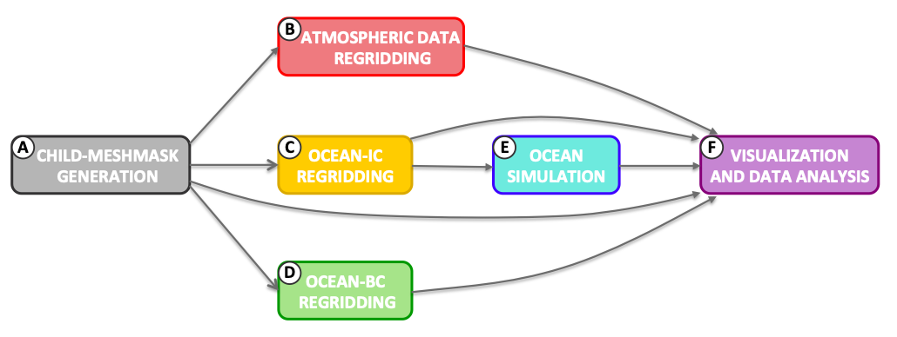
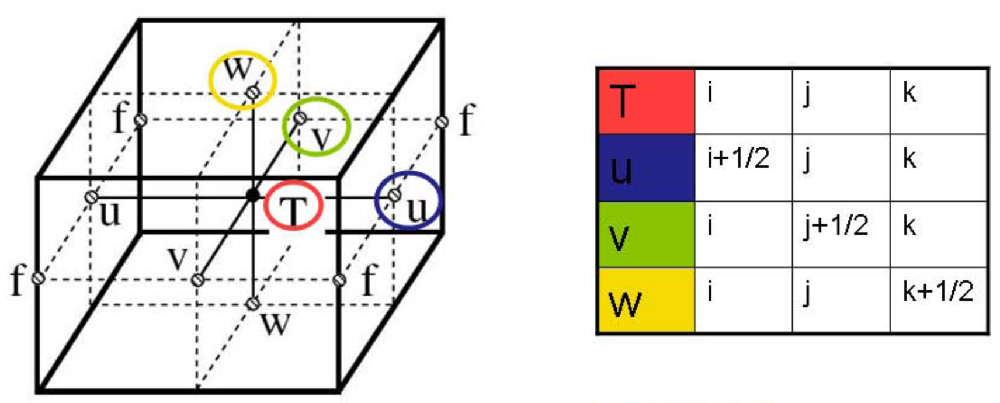

.. _workflow:

*******************************
Work-Flow of SURF-NEMO platform
*******************************

The schematic work-flow diagrams in figure :numref:`fig-workflow_schematic` shown the steps executed by the SURF-NEMO
numerical platform. In the up-to-date version release, the steps can be grouped as follows:

#. The **initialization**: the user has to specify the value of the input simulation parameters for the ocean model in the configuration file (horizontal and vertical grids, subgrid scale parameterizations, etc.) for the specific experiment he wants carried out.
#. The **access and download of the input datasets**: it is an automatic step where the input datasets for the selected period of simulation are downloaded from a remote or local data repositories as specify in the configuration file. The input data are the bathymetry, the coastline, the atmospheric forcing and the coarse resolution parent ocean model for the initial and lateral boundary condition datasets.
#. The **spatial numerical grid generation**: it is an automatic step which will generate the horizontal and vertical grid for the nested model.
#. The **input data regridding**: it is an automatic step, which generates the bottom topography, surface forcing, initial and open lateral boundary conditions datasets on the child grid.
#. The **Forecast**: it is another automatic step, where the NEMO ocean model is numerical integration and produces the final outputs
#. The **Post-processing**: this step considers the visualisation and analysis procedures of the forecast and it can be activated after the run execution (i.e. compare parent/child fields, compare the simulation results with insitu or satellite datasets and convert datasets).

.. _fig-workflow_schematic:
.. figure:: _static/figure/fig_workflow/workflow_schematic.png
   :width: 50%

   This is the caption of the figure.

The graphical calling function flow shown in figure :numref:`fig-workflow_sequential` represent all paths traversed through a program during its execution
showing step by step how the program is completed from start to finish.
We can identify 6 macro-tasks: (1) the child meshmask generation, (2) the atmospheric data regridding, (3) the ocean IC data regridding, (4) the ocean BC data regridding and OBC data extraction,
(5) the ocean Model simulation and (6) the visualization and data analysis.

.. _fig-workflow_sequential:
.. figure:: _static/figure/fig_workflow/workflow_sequential.png
   :width: 70%

   This is the caption of the figure.

Computational jobs are not all independent of one another.
The dependency flow graph of macro-tasks is shown in figure :numref:`fig-workflow_dependency`.
Each node (from A to F) represent macro-tasks, solid edges represent data dependencies among macro-tasks.
From node A, tree edges can take us to node B, node C and D.
Node E can start once all the lower nodes are completed

.. _fig-workflow_dependency:

   This is the caption of the figure.

These figures provide helpful reference for reading this chapter where we will describe in detail all the block executed
during the program flow.

Setting up the input model parameters
=====================================

The first task executed by each macro-task consists in setting-up the value of the input model parameters reading them from the configuration file.
The configuration file structure (json format) and the input parameters are described in chapter 3 and appendix A.
In this phase the procedures executed are ``read_inJsonFree`` and ``read_inJsonFixed``
to define respectively the user-free and fixed input parameters required to execute the NEMO model
and all the pre and post-processing tasks.
The procedures ``set_pathData`` and ``set_fileData`` are also call to define all the paths and files name
used by the program for the specific experiment.

Computational grid generation
=============================

After the model configuration phase, the generation of the child grid is performed. The ocean NEMO
model uses the Arakawa C grid for the spatial discretization with state variables defined on the staggered
grid illustrated in Figure :numref:`fig-arakawa_grid`. In the C grid the scalar quantities (temperature T, salinity S, pressure p,
density :math:`\rho`) are defined at the center of each grid volume, the velocity field components (zonal u, meridional
v and vertical w) are shifted by half a grid width in their respective direction so that they are defined at
the edges of the grid volumes and the relative vorticity (:math:`\zeta`) and planetary vorticity (f) are defined in the
center of each vertical edge. The main advantage of the C grid is that the pressure and convergence terms
are computed over a distance x, which is half of that in the unstaggered grid indicating a doubling of the
resolution compared to the unstuggered grid. The procedures executed in this phase are:

* Access and download of the bathymetry and costline datasets.
* Manipulation of the input bathymetry according the input configuration parameters.
* Execution of the NEMO-MESH code to generate the child 2D-mesh.
* Spatial interpolation of the bathymetric dataset on the generated child grid.
* Execution of the NEMO-MESH code to generate the 3D-meshmask.

.. _fig-arakawa_grid:

   This is the caption of the figure.

Access and download the bathymetry and costline datasets
--------------------------------------------------------

A procedure for checking if the necesary input dataset are present in the experiment directory experiments/IDEXP/data/
is executed. If some of the requested data are not present then the procedures downlCoastlineInfile, downlBathyInfile are automatically executed in order to download, respectively, the costline, the bathymetry
for the selected period of the simulation from a remote or local data repositories as specify in the configuration
Json file.

Manipulating bathymetry and shapiro filter
------------------------------------------

Manipulating bathymetry ... The Shapiro filter (Shapiro 1970, 1975) is a high order horizontal filter that
efficiently remove small scale grid noise without affecting the physical structures of a field. It is applied at
the end of the time step on both velocity and tracer fields....

Horizontal grid
---------------

The horizontal grid generation is managed by the NEMO-MESH code. The type of grid used in SURF
is a rectangular (or latitude-longitude) grid in a spherical coordinate system :math:`(\lambda,\varphi)`. The horizontal grid
(expressed in degrees) is generated by specifying the number of points :math:`n_{\lambda}` and :math:`n_{\varphi}` respectively in zonal and
meridional direction, the respective grid sizes :math:`\Delta\lambda` and :math:`\Delta\varphi` (in degrees) and the longitude and latidudine :math:`(\lambda,\varphi)_{1,1}`
of the first row and first column of T grid. On the :math:`\lambda\varphi` plane, the location of the T point of the grid are:

.. math::

   \lambda_{i,j} = \lambda_{11} + (i-1) \Delta \lambda   \hspace{0.5cm} \mbox{with} \hspace{0.2cm} i=1.....n_\lambda \\
   \varphi_{i,j} = \varphi_{11} + (j-1) \Delta \varphi   \hspace{0.5cm} \mbox{with} \hspace{0.2cm} j=1.....n_\varphi

The u, v, f point of the grid are shifted by half a grid width in zonal e/o meridional direction as indicated
in figure :numref:`fig-arakawa_grid`.

Vertical grid
-------------

The vertical grid generation is managed by the NEMO-MESH code. The type of verical grid used in SURF
corresponds to a z-coordinate vertical levels with partial bottom cell representation of the bathymetry. After
the bathymetry :math:`z = H(\lambda,\varphi)` and the number of levels :math:`n_{z}` have been specified, the vertical location of w- and
t-levels (expressed in meters) is defined, except in the bottom layer, from the following analytic expression:

.. math::

   z(k) = h_{sur} - h_0 k - h_1 log [cosh (( k - h_{th}) h_{cr})]

where the coefficients :math:`h_{sur}`, :math:`h_0`, :math:`h_1`, :math:`h_{th}` and :math:`h_{cr}` are parameters to be specified.
:math:`h_{cr}` represents the stretching factor of the grid and :math:`h_{th}` is approximately the model level at which
maximum stretching occurs.
This expression allow to define a stretched z-coordinate vertical levels which are smoothly distributed along the water column, with appropriate thinning designed to better resolve the surface and intermediate layers.
With a partial cell parameterization, the thickness of the bottom layer is allowed to vary as a function of geographical location :math:`(x,y)_{i,j}` to allow a better representation of the real bathymetry.

.. list-table::

 * - .. _fig-grid_xy:
     .. figure:: _static/figure/fig_grid/meshOceTUVxy_FC.png

        This is the caption of the figure.

   - .. _fig-grid_z:
     .. figure:: _static/figure/fig_grid/meshOceTz.png

        This is the caption of the figure.

Input data Regridding
=====================

Regridding, also called remapping, is the process of changing the grid (from a source grid, to a destination
grid) underneath field data values while preserving the qualities of the original data. We describe in this
section the spatial extrapolation and interpolation procedure adopt in SURF to remap the input fields on
the child grid. This phase will generate the surface forcing, initial and open lateral boundary conditions
datasets on the child grid. The procedures executed in this phase are:

* Access and download of the input datasets
* Rotation the vector fields (if needed)
* Extrapolation of the input datasets
* Interpolation
* Lateral Open Boundary Condition datasets generation

Access and download of the input datasets
-----------------------------------------

A procedure for checking if the necesary input dataset are present in the experiment directory experiments/IDEXP/data/
is executed. If some of the requested data are not present then the procedures downlAtmSrc, downlOceICSrc
and downlOceBCSrc are automatically executed in order to download, respectively, the costline, the bathymetry,
the atmospheric forcing and the initial and lateral boundary condition datasets for the selected period of
the simulation from a remote or local data repositories as specify in the configuration Json file

Rotation of horizontal velocity u, v
------------------------------------

When the parent coarse resolution model is defined on a rotated or a curvilinear grid (e.g. the global
GOFS16 model defined on a tripolar grid fig. :numref:`fig-orca_global`) one more step is needed in order to interpolate the
horizontal velocity fields. In an ocean model with ’distorted’ grid, the velocity vectors are given according
the direction of grid lines (black arrow in fig :numref:`fig-rotvector`). A rotation in latitudinal and longitudinal direction of
the velocity components has to be applied to turn the vectors from the local system :math:`(\xi,\eta)` to a geographical
system :math:`(lon,lat)`, so that U gives the zonal component (W-E direction) and V the meridional component (S-N
direction) of the velocity vector. Therefore, to transform between :math:`(\xi,\eta)` coordinates to :math:`(lon,lat)` coordinates,
vectors need to be rotated according to

.. math::

   U(lon_{u},lat_{u}) = U(\xi_{u},\eta_{u})*cos(\alpha_{u}) - V(\xi_{u},\eta_{u})*sin(\alpha_{u}) \\
   V(lon_{u},lat_{u}) = U(\xi_{v},\eta_{v})*sin(\alpha_{v}) + V(\xi_{v},\eta_{v})*cos(\alpha_{v})

The rotation angle :math:`\alpha(i,j)` is computed in SURF using the sosie package. For parent model with rotate
rectangles grid the angle is near constant. For parent model with curvilinear tripolar grids (as in GOFS16
model) the angle will vary through each grid cell. (PROCEDURE STILL TO BE VALIDATE.)

.. list-table::

 * - .. _fig-orca_global:
     .. figure:: _static/figure/fig_grid/orca_grid.png

        This is the caption of the figure.

   - .. _fig-rotvector:
     .. figure:: _static/figure/fig_grid/rotvector.png

        This is the caption of the figure.

Extrapolation methods
---------------------

The extrapolation procedure adopt in SURF is the so-called sea-over-land (SOL) procedure that provides us
with the ocean field values on the areas near the coastline where the parent model solutions are not defined.
The SOL procedure extrapolates iteratively the ocean quantities on the land grid-points, so that it is possible
to interpolate these quantities on the child grid. This applies also to atmospheric fields, taking into account
the atmospheric Land-Sea Mask, in order to avoid land contaminations near the land-sea boundaries.

The Sea Over Land procedure seaOverLand is applied to the Course resolution ocean fields in order to
extrapolate the salinity, temperature, sea surface height and current fields to the land points. This will
allow to define (by interpolation) the Ocen fields in the nested-grid points near to the coast. The some
procedure is adopted for the atmospheric forcing fields, taking into account the Atm Land-Sea Mask, in
order to do not have contamination from the Atm fields on the Land to the Sea points.

Interpolation methods
---------------------

The extrapolation procedure described in the previous section provides the input data for the interpolator.
The procedures used are based on the Spherical Coordinate Remapping and Interpolation Package (SCRIP)
code. SCRIP is a software package which computes addresses and weights for remapping and interpolating
fields between grids in spherical coordinates. The package should work for any grid on the surface of a
sphere. SCRIP currently supports five remapping options:

* Conservative remapping: First- and second-order conservative remapping as described in Jones (1999, Monthly Weather Review, 127, 2204-2210).
* Bilinear interpolation: Slightly generalized to use a local bilinear approximation (only logically rectangular grids).
* Bicubic interpolation: Similarly generalized (only logically-rectangular grids).
* Distance-weighted averaging: Inverse-distance-weighted average of a user-specified number of nearest neighbor values.
* Particle remapping: A conservative particle (Monte-Carlo-like) remapping scheme

The source code can be found in the directory nemo/NEMOGCM/TOOLS/WEIGHTS.

Regridding can be broken into two stages. The first stage is generation of an interpolation weight matrix
that describes how points in the source grid contribute to points in the destination grid. The second stage is
the multiplication of values on the source grid by the interpolation weight matrix to produce the appropriate
values on the destination grid.

The SCRIP spatial interpolation procedure is applied of the input fields into the generated the bathymetry,
atmosferic forcing and initial and boundary conditions files necessary to run the NEMO code. This procedure
generates the files xxxxxxxx which are stored in the directory experiments/IDEXP/.

Lateral Open Boundary Condition datasets
----------------------------------------

The implementation of the lateral open boundary condition for the selected nested-domain is done using the
BDY module of NEMO. Two different numerical algorithms to treat open boundary conditions are adopted
depending on the prognostic simulated variables. For the barotropic velocities the Flather scheme (Oddo and
Pinardi, 2008) is used, while for baroclinic velocities, active tracers and sea surface height we consider the
flow relaxation scheme (Engerdahl, 1995). In our formulation we provide external data along straight open
boundary lines and the relaxation area is equal to one internal grid point. As the parent coarse resolution
Ocean model provides only the total velocity field, the interpolated total velocity field into the child grid
has been split into barotropic and baroclinic components. In order to preserve the total transport after the
interpolation an integral constraint method is imposed

This process involves the following steps: (1) the definition of the open boundary geometry (for each of the
T,U and V grids) and physical fields (active tracers, sea-surface height, barotropic and baroclinic velocities)
at the open boundary points using, respectively, the procedures geometry_bdy and fields_bdy, (2) the
writing of these data arrays to the files necessary to run the NEMO code. The algorithm used for the
different fields are: the Flather radiation scheme for the barotropic velocities and the sea surface height and
the Flow relaxation scheme for the baroclinic velocities and active tracers. The generated files will be stored
in the directory experiments/NOMEEXP.

Model run
=========

Finally, the SURF platform proceeds with numerical integration of NEMO. During the execution of the
main program, output files will be continuously updated given the fixed output frequency.

You can also examine how far the run has advanced using the command grep to the NEMO logfile, which
is a text file NEMO produces and in which the time step is written.

After the model has finished, , something like this will be written to the terminal:

The output files will be stored in the directory where the user is running the model.

Post-processing
===============

This step considers the visualisation and analysis procedures of the forecast and it can be activated after
the run execution. The user can visualize the input/output datasets, compare parent/child fields, compare
the simulation results with insitu or satellite datasets and convert datasets
